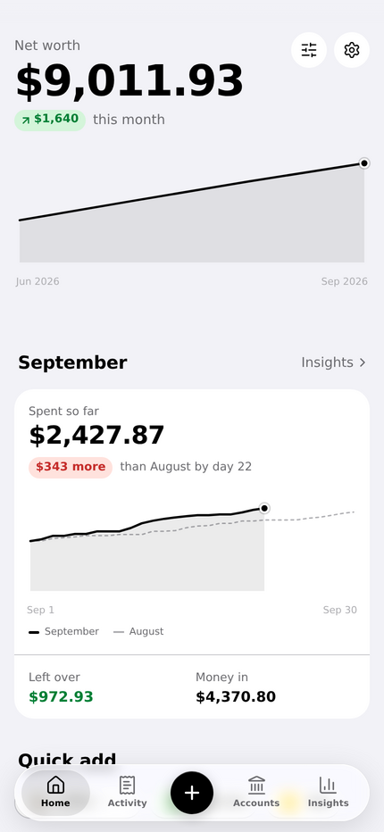
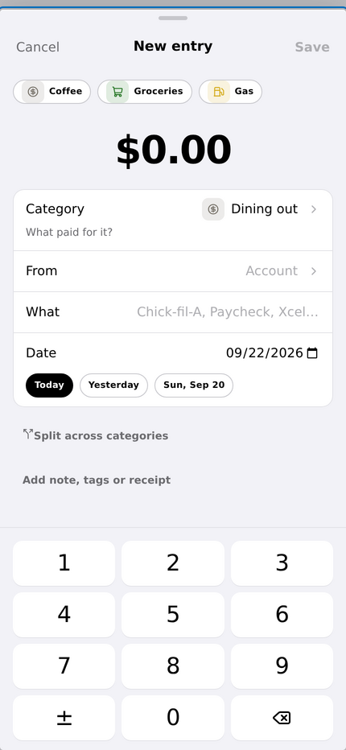
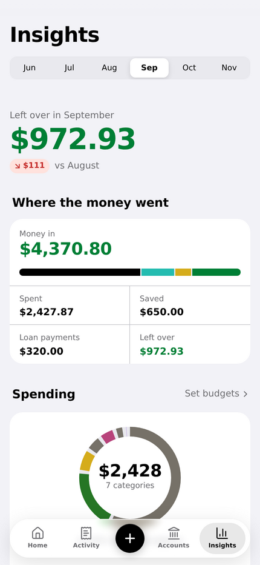
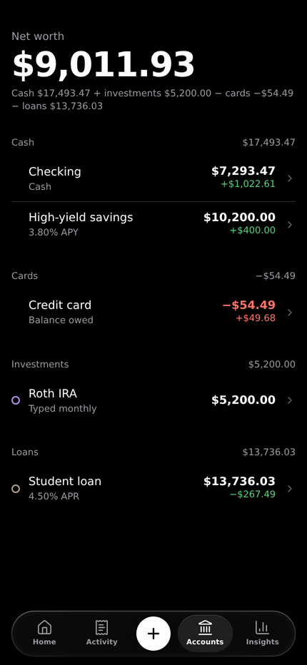

# Tally

A personal finance app I built to replace the spreadsheet I tracked my money in. FastAPI and SQLite on the
back end, a React PWA on the front, laid out for an iPhone home screen first and a desktop browser second.

<p>
  
  
  
  
</p>

The screenshots use made-up data from `scripts/seed_demo.py`.

## How it works

Every entry is one row: a date, a name, a category, an amount, and a From and/or To account. That's the same
model the spreadsheet used. No balance is ever stored. Account balances, net worth and monthly totals are derived
from the rows by `app/engine.py`, a pure module with no database access, which is where most of the tests point.

The category's type decides which accounts an entry takes, and the API rejects anything else:

| Type | From | To |
|---|---|---|
| Money in | blank | required |
| Spending | required | blank |
| Transfer | required | required |
| Saving, Loan | required | optional |

Cash accounts go up with To and down with From. Cards run the other way, since their balance is money owed.
Loans accrue interest monthly at their rate and drop with each payment. Investment balances are typed in at month
end rather than modeled.

Amounts are integer cents in the database, the engine and the browser. Request bodies carry dollars and are
converted once, on the way in.

## Features

- Home is a set of widgets you can reorder or hide: net worth, spending pace against last month, budgets,
  emergency fund, upcoming recurring entries.
- Adding an entry uses a custom keypad with quick-add shortcuts, merchant memory, splits across categories, tags,
  notes and receipt photos.
- Activity searches names, notes, tags and amounts, with filters, saved views and bulk edits.
- Deletes don't ask first. They happen immediately and show an undo toast, and undo restores the original row
  (same id, receipt and recurring link) instead of creating a new one.
- Reconcile an account against the bank's number and see where the gap came from, plus a month-end checklist.
- Recurring templates post entries about 45 days ahead. Monthly ones keep their day, so the 31st stays the 31st
  (or the last day of shorter months).
- Budgets show a marker for how far through the month you are, and can be suggested from the last three months.
- The app shell and data are cached for offline reading. New entries made offline wait on the phone and sync
  later. Each carries a client id with a unique index, so a retry whose first attempt already landed gets the
  existing row back instead of creating a duplicate.
- CSV export of the full log and the monthly summary.
- `app/importer.py` brought in the original spreadsheet and checked that every balance matched to the cent.

## Stack

- **Backend:** Python 3.13, FastAPI, SQLite through the standard library (no ORM), managed with uv.
- **Frontend:** React 19, TypeScript, Vite, React Router, TanStack Query and Motion. Plain CSS modules on a set of
  design tokens, no UI kit. The service worker comes from vite-plugin-pwa (Workbox).

`DESIGN.md` has the design rules: type scale, color tokens, where glass is allowed, and what's allowed to animate.

## Running it

You need [uv](https://docs.astral.sh/uv/) and Node 22.

```sh
uv sync
(cd web && npm ci && npm run build)              # builds the frontend into app/static/dist
uv run python scripts/seed_demo.py data/demo.db  # optional: fake accounts and three months of entries
TALLY_DB=data/demo.db uv run uvicorn app.main:app --port 8000
```

Then open http://localhost:8000. Without `TALLY_DB` it creates an empty `data/tally.db`.

For frontend work, run `npm run dev` in `web/`. Vite serves on :5173 and proxies `/api` to :8000.

Run the tests with `uv run pytest`.

There is no login. I run it on a home server, bound to localhost and reachable only over Tailscale, so the
tailnet is the access control. Don't put it on the open internet as it is.

## Layout

```
app/engine.py       balance engine: months, balances, net worth (no DB access)
app/db.py           schema and per-request connections
app/migrate.py      additive, idempotent migrations
app/api*.py         JSON API: entries, accounts and categories, reconcile and month end, receipts
app/recurring.py    posts recurring templates ahead
app/importer.py     spreadsheet import with cent-level verification
app/main.py         routers, CSV exports, serves the built frontend
web/src/screens     Home, Activity, Add sheet, Accounts, Insights, Settings
web/src/components  keypad, rolling-digit amounts, scrubbable charts, sheets, pickers
tests/              engine and API tests against throwaway databases
scripts/            demo data and my nightly backup script
```

Release notes are in `CHANGELOG.md`.
